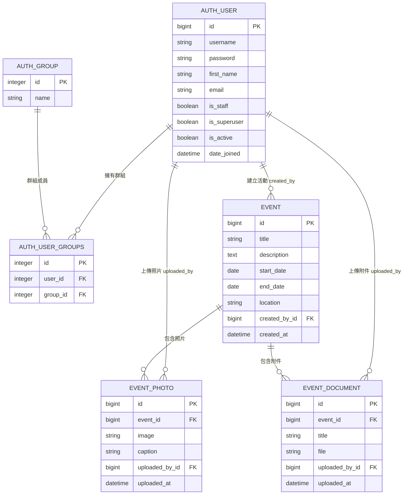
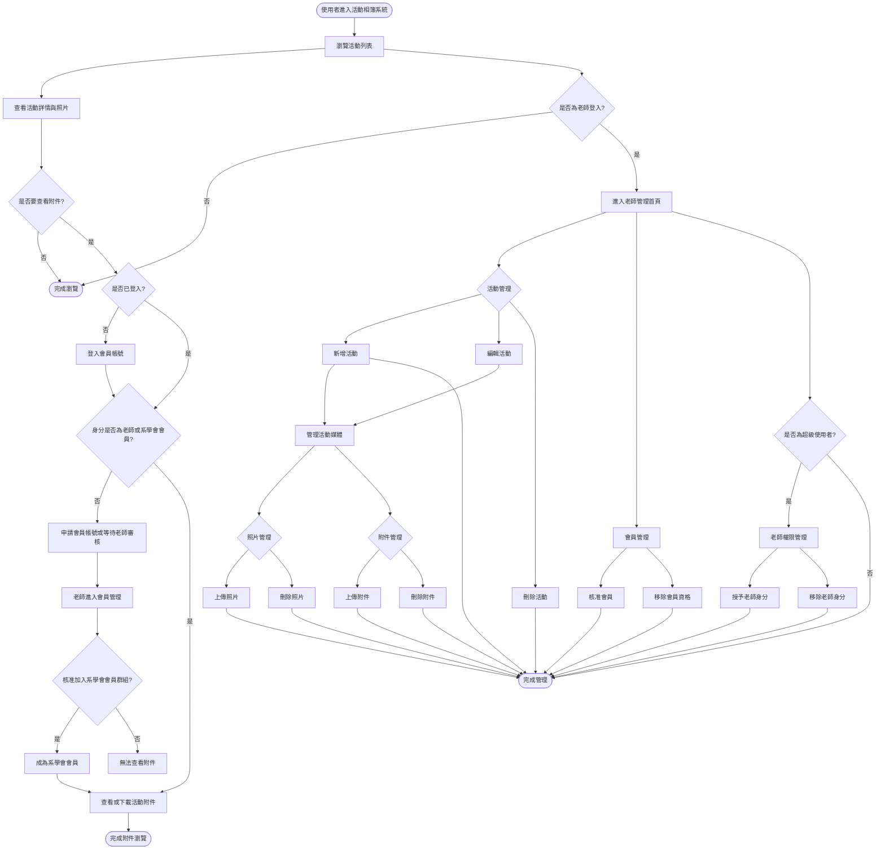

# 資科系活動相簿：ER 圖與系統流程圖

本文件整理專案目前的資料表關聯與主要系統流程，可直接貼到支援 Mermaid 的 Markdown、Mermaid Live Editor，或 draw.io 的 Mermaid 匯入功能使用。

## ER 圖



## dbdiagram DBML 版本

可貼到 dbdiagram.io 使用。

```dbml
Table auth_user {
  id bigint [pk]
  username varchar
  password varchar
  first_name varchar
  email varchar
  is_staff boolean
  is_superuser boolean
  is_active boolean
  date_joined datetime
}

Table auth_group {
  id int [pk]
  name varchar
}

Table auth_user_groups {
  id int [pk]
  user_id int [ref: > auth_user.id]
  group_id int [ref: > auth_group.id]
}

Table albums_event {
  id bigint [pk]
  title varchar
  description text
  start_date date
  end_date date
  location varchar
  created_by_id bigint [ref: > auth_user.id]
  created_at datetime
}

Table albums_eventphoto {
  id bigint [pk]
  event_id bigint [ref: > albums_event.id]
  image varchar
  caption varchar
  uploaded_by_id bigint [ref: > auth_user.id]
  uploaded_at datetime
}

Table albums_eventdocument {
  id bigint [pk]
  event_id bigint [ref: > albums_event.id]
  title varchar
  file varchar
  uploaded_by_id bigint [ref: > auth_user.id]
  uploaded_at datetime
}
```

## 系統流程圖



## 主要角色與權限

| 角色 | 可瀏覽活動與照片 | 可查看附件 | 可管理活動 | 可管理照片/附件 | 可管理會員 | 可管理老師 |
| --- | --- | --- | --- | --- | --- | --- |
| 一般訪客 | 是 | 否 | 否 | 否 | 否 | 否 |
| 已註冊但未審核會員 | 是 | 否 | 否 | 否 | 否 | 否 |
| 系學會會員 | 是 | 是 | 否 | 否 | 否 | 否 |
| 老師 staff | 是 | 是 | 是 | 是 | 是 | 否 |
| 超級使用者 superuser | 是 | 是 | 是 | 是 | 是 | 是 |

## 圖表說明

- `Event` 是活動主表，記錄活動名稱、日期區間、地點、說明與建立者。
- `EventPhoto` 是活動照片表，一個活動可以有多張照片。
- `EventDocument` 是活動附件表，一個活動可以有多個附件。
- `auth_user` 是 Django 內建使用者表，用於會員、老師與超級使用者登入。
- `auth_group` 與 `auth_user_groups` 是 Django 內建群組關聯，用來判斷使用者是否屬於「系學會會員」。
- 老師身分使用 `auth_user.is_staff = true` 判斷。
- 超級使用者身分使用 `auth_user.is_superuser = true` 判斷，主要用於授予或移除老師權限。
